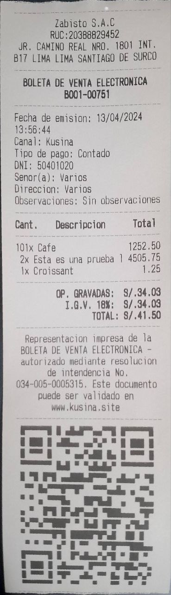
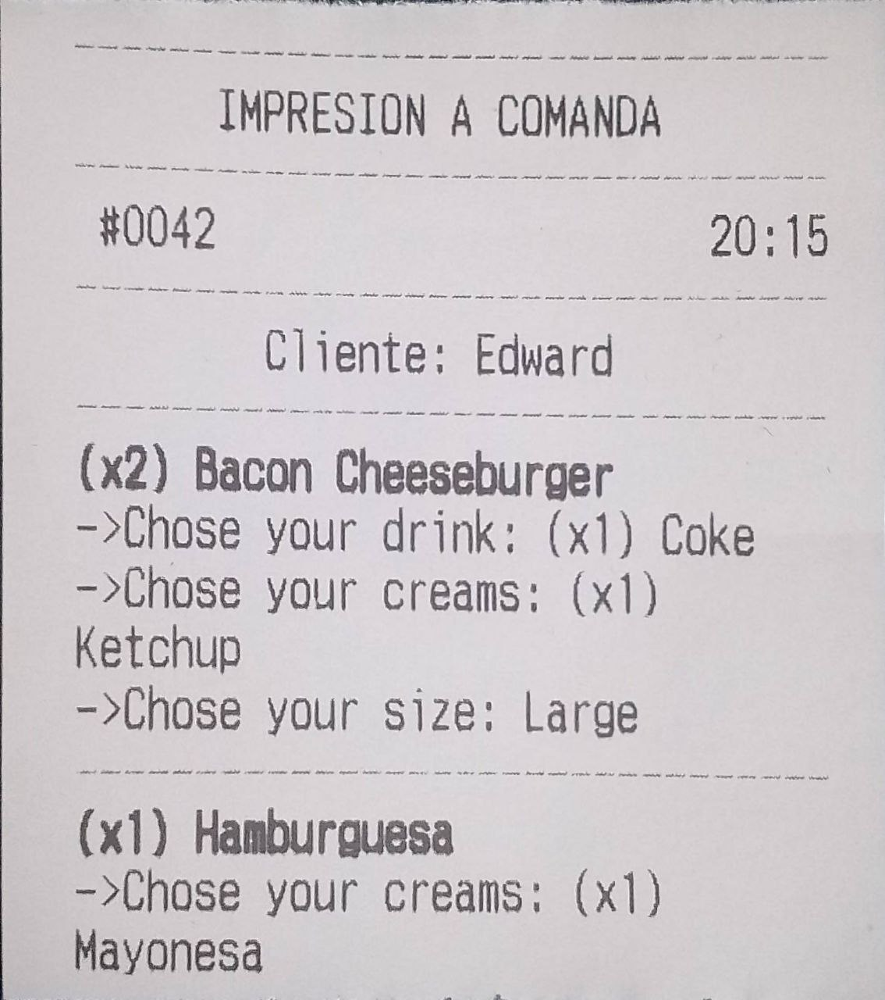

# LOCAL SERVER - THERMAL PRINTER

This thermal printer runs a local server (8000) to sent invoices, receipts, etc. to print. It does not have Bluetooth connectivity.

## Note

* Run `git clone https://github.com/e-lua/ThermalPrinter.git`
* Command `uvicorn main:app --reload`

## Test it!

* Open the software `software/main.exe`
* For end the software `crtl+c`
* **Get printers** GET `http://127.0.0.1:8000/printers`
* **Print Invoice** POST `http://127.0.0.1:8000/print`
```
{
  "printer_name": "NAME_OF_PRINTER",
  "printer_width": 58_OR_80,
  "sections": []
}
```
```
{
  "printer_name": "POS-58",
  "printer_width": 58,
  "sections": [
    {
      "type": "lines",
      "content": [
        {
          "text":  "TEST S.A.C",
          "align": "center"
        },
        {
          "text":  "RUC: 00000000000",
          "align": "center"
        },
        {
          "text":  "JR. CAMINO REAL NRO. 1801 INT. B17 LIMA LIMA SANTIAGO DE SURCO",
          "align": "center"
        }
      ]
    },
    {
      "type": "lines",
      "content": [
        {
          "text": "BOLETA DE VENTA ELECTRÓNICA\nB001-00751\n",
          "bold": true
        }
      ]
    },
    {
      "type": "lines",
      "content": [
        {
          "text": "Fecha de emisión: 13/04/2024 13:56:44",
          "align": "left"
        },
        {
          "text": "Canal: Kusina",
          "align": "left"
        },
        {
          "text": "Tipo de pago: Contado",
          "align": "left"
        },
        {
          "text": "DNI: 50401020",
          "align": "left"
        },
        {
          "text": "Señor(a): Varios",
          "align": "left"
        },
        {
          "text": "Dirección: Varios",
          "align": "left"
        },
        {
          "text": "Observaciones: Sin observaciones",
          "align": "left"
        }
      ]
    },
    {
      "type": "products",
      "content": [
        {
          "quantity": 101,
          "description": "Café",
          "price": 1252.50,
          "align": "left"
        },
        {
          "quantity": 2,
          "description": "Esta es una prueba larga de producto",
          "price": 4505.75,
          "align": "left"
        },
        {
          "quantity": 1,
          "description": "Croissant",
          "price": 1.25,
          "align": "left"
        }
      ]
    },
    {
      "type": "lines",
      "content": [
        {
          "text": "OP. GRAVADAS:  S/.34.03",
          "bold": true,
          "align": "right"
        },
        {
          "text": "I.G.V. 18%:  S/.34.03",
          "bold": true,
          "align": "right"
        },
        {
          "text": "TOTAL: S/.41.50",
          "bold": true,
          "align": "right"
        }
      ]
    },
    {
      "type": "lines",
      "content": [
        {
           "text": "Representacion impresa de la BOLETA DE VENTA ELECTRÓNICA - autorizado mediante resolución de intendencia No. 034-005-0005315. Este documento puede ser validado en www.kusina.site"
        }
      ]
    },
    {
      "type": "qr_code",
      "content": {
        "data": "https://mitienda.com/factura/12345"
      }
    },
    {
      "type": "lines",
      "content": [
        {
           "text": ""
        }
      ]
    }
  ]
}
```



* **Print kitchen** POST `http://127.0.0.1:8000/print`
```
{
  "printer_name": "NAME_OF_PRINTER",
  "printer_width": 58_OR_80,
  "sections": []
}
```
```
{
  "printer_name": "POS-58",
  "printer_width": 58,
  "sections": [
    {
      "type": "lines",
      "content": [
        {
          "text":  "IMPRESION A COMANDA",
          "align": "center"
        },
        {
          "text": "",
          "underline": true
        }
      ]
    },
    {
      "type": "two_columns",
      "content": [
        {
          "left": " #0042",
          "right": "20:15"
        }
      ]
    },
    {
      "type": "lines",
      "content": [
        {
          "text":  "Cliente: Edward"
        }
      ]
    },
    {
      "type": "lines",
      "content": [
        {
          "text": "",
          "underline": true
        },
        {
          "text":  "(x2) Bacon Cheeseburger",
          "align": "left",
          "bold": true
        },
        {
          "text":  "->Chose your drink: (x1) Coke",
          "align": "left"
        },
        {
          "text":  "->Chose your creams: (x1) Ketchup",
          "align": "left"
        },
        {
          "text":  "->Chose your size: Large",
          "align": "left"
        }
      ]
    },
    {
      "type": "lines",
      "content": [
        {
          "text": "",
          "underline": true
        },
        {
          "text":  "(x1) Hamburguesa",
          "align": "left",
          "bold": true
        },
        {
          "text":  "->Chose your creams: (x1) Mayonesa",
          "align": "left"
        }
      ]
    },
    {
      "type": "lines",
      "content": [
        {
           "text": ""
        }
      ]
    }
  ]
}
```

